# Scikit model in a flask app on railway
Don't understand a word of this heading? Let's translate.

So far, you've learned to set up scikit-learn models in Jupyter notebooks. But if you work for a client, how are they going to use your model? Surely they don't want to learn Python to get their predictions.

Here is where flask apps come into play. [Flask](https://flask.palletsprojects.com/en/stable/) is a web application framework. It allows you to create an application which will nicely package your model into a box. The client will insert an observation and the application will return the prediction for it.

Now this application has to run somewhere. It could be on an internal company server, but it could also be hosted on a cloud. [Railway](https://railway.com/) offers infrastructure to run web applications and also provides databases where you can store the data - the observations and the predictions.


## 0. tl;dr

You can deploy your own model by

1. Copying the contents of this repo to a new directory
1. Replace `pipeline.pickle`, `dtypes.pickle`, and `columns.json` with
   your own
1. Deploy to railway

You'll probably run into a few issues along the way which is why you'll at least want to
skim the contents of the notebooks and this README, in order to have an idea of
where to look when you hit a bump in the road.

## 1. Intro

This is a very simplistic yet effective way to deploy a scikit model behind an HTTP server on railway.

There are 4 main topics to cover here:

1. Serialization
    - This is covered in the notebooks
1. Flask
    - Covered here in the README
1. Database connection
    - Covered here in the README
1. Deployment to railway
    - Also covered here in the README

### 1.1 Before you continue

Topic #1 is the only one that is not covered here in this README. It is covered in two learning notebooks
that you should read before moving on with the rest of this README.

Learning notebook 1 has to do with training and serializing a scikit model as well as how to prepare a new observation that arrives for prediction.

Learning notebook 2 explains how to deserialize the saved model so that you can use a trained model with new observations without having to re-train it.

### 1.2 Python virtual environment

You've probably noticed that we have two requirements files in this repo: `requirements_dev.txt` and `requirements_prod.txt`.

The `requirements_dev.txt` file has the packages that are needed while preparing the model and include jupyter and matplotlib.

The `requirements_prod.txt` file has the packages that are needed when we deploy our model. At that point, we won't need jupyter or matplotlib, so we can save some resources by not installing them.

Now go ahead and create a Python virtual env using the requirements in `requirements_dev.txt` in order to follow this tutorial.

## 2. Flask

Have you already read and understood the notebooks on serialization? Have you already tested your understanding
by pickling and un-pickling your scikit model? Yes yes? Alrighty then, you may continue.

### 2.1 What is flask

[Flask](https://flask.palletsprojects.com/en/stable/) is an HTTP micro-framework. It is a very minimal code library that allows
for quick and simple HTTP server development and is a great alternative to bigger frameworks like Django.
However, be wary before moving forward with a big project using flask - it can get out of hand very quickly
without the enforced structure that other heavier frameworks like Django provide.

For us, since we only need a total of two endpoints (an endpoint is the URL that is used to request an action from the server; in our case we will need two types of actions: requesting a prediction for an observation, and updating an observation's true class) and it doesn't even need to be [RESTful](https://en.wikipedia.org/wiki/Representational_state_transfer), we can stick with
flask and be reasonably justified in it.

### 2.2 Create an HTTP server

In order to use flask, you will need to write code in a regular
Python file - no more notebooks here.

The first step (assuming you have already created a virtual environment and installed the requirements in `requirements_dev.txt`), is to import flask at the top of the file and create the HTTP server. Let's pretend that we are working in a file called `app.py` in our newly created virtual environment.

We're doing three imports. The [Flask](https://flask.palletsprojects.com/en/stable/api/#application-object) object is for creating an HTTP server. The [request](https://flask.palletsprojects.com/en/stable/api/#flask.request) object does exactly what the name suggests: holds all of the contents of an HTTP request that someone is making. The [jsonify](https://flask.palletsprojects.com/en/stable/api/#flask.json.jsonify) function converts objects such as dictionaries to json.

Next we use the Flask constructor to create a new application. We will add routes to it later.

```py
from flask import Flask, request, jsonify

app = Flask(__name__)
```

This server doesn't do anything yet. In order to make it do stuff we will
need to add HTTP endpoints.

### 2.3 Make HTTP endpoints

With flask, creating an HTTP endpoint is incredibly simple, assuming that we already
have the `app` object created with the `Flask` constructor. Let's make an endpoint that will serve the predictions:

```py
@app.route('/predict', methods=['POST'])
def predict():
    prediction = 0.5
    return jsonify({
        'prediction': prediction
    })
```

The above route isn't very smart in that it returns the same
prediction every time (0.5) and it doesn't actually care about the input
that you sent it. But hey, with just a few lines of code we've almost created an entire server that serves a prediction!

### 2.4 Make a complete server

Putting it all together with a few lines of code at the end (in order to start
the server in development mode), we've created an entire server.

```py
from flask import Flask, request, jsonify

app = Flask(__name__)

@app.route('/predict', methods=['POST'])
def predict():
    prediction = 0.5
    return jsonify({
        'prediction': prediction
    })
    
if __name__ == "__main__":
    app.run(debug=True)

```

Create a new file called `first_app.py` and save the above code. To run the server, open a terminal window and create a new virtual environment for production with the `requirements_prod.txt` file. Then run the server by executing `python3.12 first_app.py`. Your server will now be running locally.

Now you can send requests to your server and get predictions. Open a new terminal window and execute the following command in order to get a prediction:

```bash
curl -X POST http://localhost:5000/predict
```

You should get the following output:
```
{
  "prediction": 0.5
}
```

We are using the [curl](https://curl.se/) library here to transfer data to our local server.

Alright, now that we can run a full flask server, let's try to make something a bit more
useful - a server that can receive data.

### 2.5 Receive a new observation

Let's set up the server so that it can receive information from us. There's a pretty nice way to do this via the
[get_json](https://flask.palletsprojects.com/en/stable/api/#flask.Response.get_json) flask function.

For this server, let's say that the model only takes a single field called `unemployed`
and returns `true` if `unemployed` is true and `false` otherwise. The server would now
look like this:

```py
from flask import Flask, request, jsonify

app = Flask(__name__)

@app.route('/predict', methods=['POST'])
def predict():
    payload = request.get_json()
    at_risk = payload['unemployed']
    return jsonify({
        'prediction': at_risk
    })

if __name__ == "__main__":
    app.run(debug=True)
```
Add this code to your `first_app.py` file. You can notice that the server has automatically restarted when you made changes to the app file (unless you made a syntax error in which case it shut down). Now test the server with the following examples:
```bash
curl -X POST http://localhost:5000/predict -d '{"unemployed": true}' -H "Content-Type:application/json"
```

You should get:
```
{
  "prediction": true
}
```

For this command:
```bash
curl -X POST http://localhost:5000/predict -d '{"unemployed": false}' -H "Content-Type:application/json"
```

You should get:
```
{
  "prediction": false
}
```

Take a quick note that we had to supply a header of `Content-Type:application/json`
and json data of `{"unemployed": false}`.

### 2.6 Integrate a scikit model

Now that we know how to get a Python dictionary via the flask `get_json`
function, we're at a point in which we can pick up where the last tutorial
notebook left off! We will insert the pickled model into the app and make it receive new observations and return predictions. Let's tie it all together by:

1. Deserializing the model, columns, and dtypes
1. Turn the new observation into a pandas dataframe
1. Call `predict_proba` to get the likelihood of survival of the new observation

```py
import joblib
import json
import pickle
import pandas as pd
from flask import Flask, request, jsonify

app = Flask(__name__)


with open('columns.json') as fh:
    columns = json.load(fh)

with open('dtypes.pickle', 'rb') as fh:
    dtypes = pickle.load(fh)

pipeline = joblib.load('pipeline.pickle')


@app.route('/predict', methods=['POST'])
def predict():
    payload = request.get_json()
    obs = pd.DataFrame([payload], columns=columns).astype(dtypes)
    proba = pipeline.predict_proba(obs)[0, 1]
    return jsonify({
        'prediction': proba
    })


if __name__ == "__main__":
    app.run(debug=True)
```

Check out how we have now taken the payload and turned it into
a new observation that is a single entry in a dataframe,
and can be consumed by the pipeline to be turned into a prediction
of survival. Copy the code into your app file and test it with the following:

```
curl -X POST http://localhost:5000/predict -d '{"Age": 22.0, "Cabin": null, "Embarked": "S", "Fare": 7.25, "Parch": 0, "Pclass": 3, "Sex": "male", "SibSp": 1}' -H "Content-Type:application/json"
```

You should get:
```
{
  "prediction": 0.16097398111735517
}
```

## 3. Keeping track of your predictions

Okay, now that you can get data, produce predictions, and return those predictions,
you will need to keep track of what you've been saying about who.
Said another way: you can't just provide predictions and then just forget about it all. You need to
take record of what you have predicted about which input, so that later on you can do some additional analysis on your "through the door" population.

In order to do this, we will need to start working with a database. The database
will keep track of the observations, the predictions that the model provided for them,
and the true outcomes (should we be lucky enough to find out about them).

### 3.1 ORMs and peewee

When working with databases in code, you generally want to be using a layer of abstraction
called an [ORM](https://en.wikipedia.org/wiki/Object-relational_mapping). For this
exercise we will use a very simplistic ORM called [peewee](http://docs.peewee-orm.com/en/latest/index.html).
This will allow us to use a local database called [sqlite](https://en.wikipedia.org/wiki/SQLite) (which is basically a file)
when we are developing on our laptops, and use a more production-ready database called
[postgresql](https://en.wikipedia.org/wiki/PostgreSQL) when deploying to railway, with very
little change to our code.

One cool thing that ORMs allow us to do is define the data model. So let's use peewee to create a data model to keep track of
predictions and the probabilities we have assigned to them. Once again, we can
take care of this with a few lines of code:

```py
from peewee import (
    SqliteDatabase, Model, IntegerField,
    FloatField, TextField,
)

DB = SqliteDatabase('predictions.db')

class Prediction(Model):
    observation_id = IntegerField(unique=True)
    observation = TextField()
    proba = FloatField()
    true_class = IntegerField(null=True)

    class Meta:
        database = DB

DB.create_tables([Prediction], safe=True)
```

Now we need to take a moment to understand exactly how much these
few lines of code have done for us because it is A LOT.

#### 3.1.1 Connect to database

`DB = SqliteDatabase('predictions.db')`

Create an sqlite database that will be stored in a file called `predictions.db`.
This may seem trivial right now, but soon enough you will see that changing
out this line of code for another one will result in a lot of value for the effort.

#### 3.1.2 Define the data model

```
Class Prediction(Model):
   ...
```   

Define the data model that we will work with, so basically the fields in the database table. The model has fields for
the following:

- `observation_id`
    - There must be a unique identifier to all observations and it is
      the responsibility of the person providing the observation to give
      this id.
- `observation`
    - We should record the observation itself when it comes, in case
      we want to retrain our model with it later on.
- `proba`
    - The probability of survival that we predicted for the observation.
- `true_class`
    - This is for later on, in case we find out what is the true value of the target for the observation for which we supplied a prediction.

#### 3.1.3 Create the table

`DB.create_tables([Prediction], safe=True)`

The model that we specified must correspond to a database table.
Creation of these tables is something that is its own non-trivial
headache, and this one line of code makes it so that we don't have to worry about any of it.

## 4. Integrate the database with the webserver

Now that we have a webserver and a database that we are happy with, the next question is how do we put them together? It's actually pretty straightforward!

```py
import joblib
import json
import pickle
import pandas as pd
from flask import Flask, jsonify, request
from peewee import (
    SqliteDatabase, PostgresqlDatabase, Model, IntegerField,
    FloatField, TextField, IntegrityError
)
from playhouse.shortcuts import model_to_dict


########################################
# Begin database stuff

DB = SqliteDatabase('predictions.db')


class Prediction(Model):
    observation_id = IntegerField(unique=True)
    observation = TextField()
    proba = FloatField()
    true_class = IntegerField(null=True)

    class Meta:
        database = DB


DB.create_tables([Prediction], safe=True)

# End database stuff
########################################

########################################
# Unpickle the previously-trained model


with open('columns.json') as fh:
    columns = json.load(fh)


with open('dtypes.pickle', 'rb') as fh:
    dtypes = pickle.load(fh)


pipeline = joblib.load('pipeline.pickle')


# End model un-pickling
########################################


########################################
# Begin webserver stuff

app = Flask(__name__)


@app.route('/predict', methods=['POST'])
def predict():
    obs_dict = request.get_json()
    _id = obs_dict['id']
    observation = obs_dict['observation']
    obs = pd.DataFrame([observation], columns=columns).astype(dtypes)
    proba = pipeline.predict_proba(obs)[0, 1]
    response = {'proba': proba}
    p = Prediction(
        observation_id=_id,
        proba=proba,
        observation=request.data
    )
    try:
        p.save()
    except IntegrityError:
        error_msg = "ERROR: Observation ID: '{}' already exists".format(_id)
        response["error"] = error_msg
        print(error_msg)
        DB.rollback()
    return jsonify(response)


# End webserver stuff
########################################

if __name__ == "__main__":
    app.run(debug=True)

```

One piece of the code above that might not be clear at first is:

```py
    p = Prediction(
        observation_id=_id,
        proba=proba,
        observation=request.data,
    )
    try:
        p.save()
    except IntegrityError:
        error_msg = "ERROR: Observation ID: '{}' already exists".format(_id)
        response["error"] = error_msg
        print(error_msg)
        DB.rollback()
```

What is this code doing? When we receive a new prediction request, we want to store such request
in our database (to keep track of our model performance). With peewee, we save a new Prediction (basically
a new row in our table) with the `save()` method, which is very neat and convenient.

However, because our table has a uniqueness constraint (no two rows can have the same `observation_id`),
if we perform the same prediction request twice (with the same id) the system will crash because pewee can't save
again an already saved `observation_id`. It will throw an `IntegrityError` (as in, we would be asking pewee to violate
the integrity of the table's unique id requirement if we saved a duplicated id, right?).

To avoid that, we do a simple try/except block: if we try a request with the same `observation_id`, peewee will raise the integrity error and we'll catch it, print a nice error message, and do a database rollback (to close the current save transaction that has failed).

Once your app is setup like this, you can test this with the following command:

```bash
curl -X POST http://localhost:5000/predict -d '{"id": 0, "observation": {"Age": 22.0, "Cabin": null, "Embarked": "S", "Fare": 7.25, "Parch": 0, "Pclass": 3, "Sex": "male", "SibSp": 1}}' -H "Content-Type:application/json"
```

You should get:
```
{
  "proba": 0.16097398111735517
}
```

Now let's take note of the few things that changed:

1. The structure of the json input changed. It now includes two top level entries:
    - `id` - This is the unique identifier of the observation;
    - `observation` - This is the actual observation contents that will be sent to
      the pipeline we have un-pickled.
1. We create an instance of `Prediction` with the 3 fields that we care about.
1. We call `save()` on the prediction to save it to the database.
1. We return `proba` so that the caller of the HTTP endpoint knows what the model
says about the observation.

## 5. Receiving updates

Now that we have a way to provide predictions AND keep track of them, we should
take it to the next level and provide ourselves with a way to receive updates
on the true class of the observations that we have judged with our predictive model.

We can do this with one extra `update` endpoint that is very straightforward and only
introduces one new concept: database querying through the ORM.

```py
@app.route('/update', methods=['POST'])
def update():
    obs = request.get_json()
    try:
        p = Prediction.get(Prediction.observation_id == obs['id'])
        p.true_class = obs['true_class']
        p.save()
        return jsonify(model_to_dict(p))
    except Prediction.DoesNotExist:
        error_msg = 'Observation ID: "{}" does not exist'.format(obs['id'])
        return jsonify({'error': error_msg})
```

Assuming that we have already processed an observation with id=0, we
can now receive and record the true outcome. Imagine that it is discovered
later on that the person with id=0 didn't survive the Titanic disaster. They
would probably enter something into a content management system that
would then trigger a call to your server which would end up looking like
the following:

```bash
curl -X POST http://localhost:5000/update -d '{"id": 0, "true_class": 0}'  -H "Content-Type:application/json"
```

And it would elicit a response from your server like:
```
{
  "id": 1,
  "observation": "{\"id\": 0, \"observation\": {\"Age\": 22.0, \"Cabin\": null, \"Embarked\": \"S\", \"Fare\": 7.25, \"Parch\": 0, \"Pclass\": 3, \"Sex\": \"male\", \"SibSp\": 1}}",
  "observation_id": 0,
  "proba": 0.16097398111735517,
  "true_class": 0
}
```

Similarly to when we saved the prediction requests, we validate that the `observation_id` we want to update actually exists.

Now to wrap it all up, the way that we can interpret this sequence of events is the following:

1. We provided a prediction of 0.161 probability of survival;
1. We found out later that the person didn't survive.


## 6. Deploy to railway

It's cool and all that we can run the servers on our own machines. However, it doesn't
do much good in terms of making the model available to the rest of the world. All this
`localhost` stuff doesn't help anybody who's not at your local machine.

So let's take all of the work we've done getting this running and put it on a cloud where it can generate real business value. For this part, you can use any server
that has a static IP address though since we want to avoid the overhead of administering
our own server, we will use a service to do this for us called [railway](https://railway.app/).
Railway includes a free-tier that should be enough for our needs throughout this specialization and the whole capstone project, but **only if you remember to turn off your applications once you're done with them**. You have a **$5.00** of credit and **it's your responsibility to manage this**. Be careful before you move forward with a big project on railway -
it can get CRAZY expensive REALLY fast.

### 6.1 Set up your repo
Railway will deploy your code from a GitHub repo, so first you need to make a copy of this repository and make sure that your app code is in the `app.py` file.

### 6.2 Sign up and set up at railway

Go to the [railway main page](https://railway.app/) and start a new project deployed from a github repo. Alternatively you can use the login button.

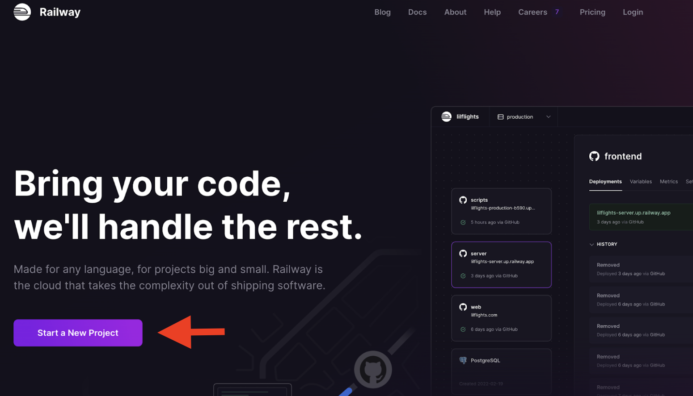
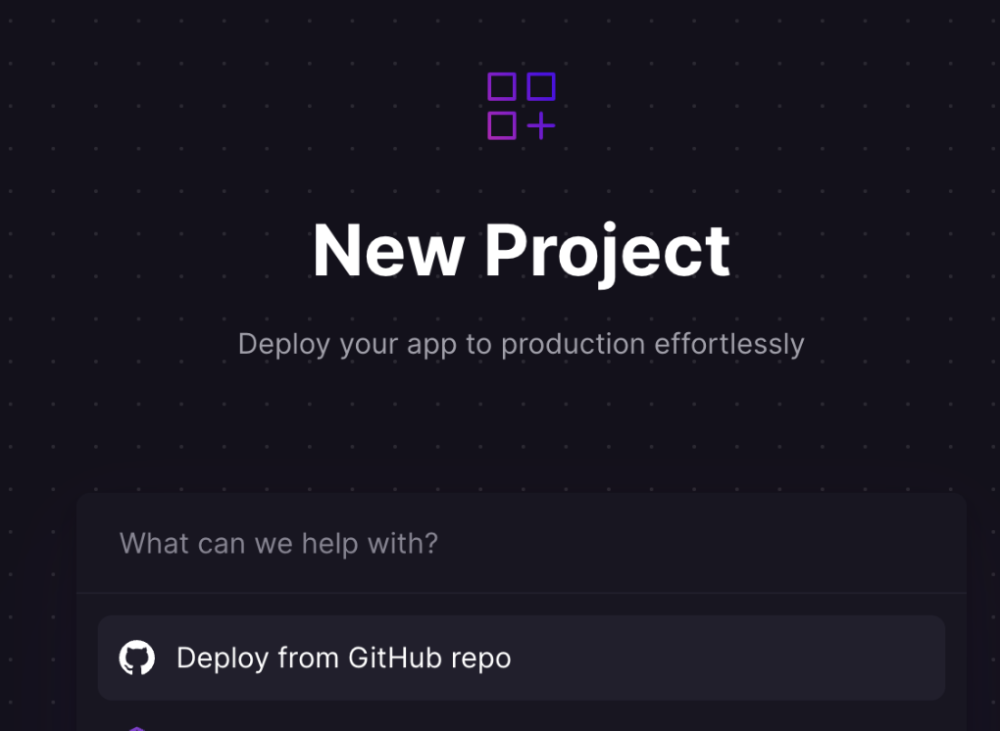

Sign in using your GitHub credentials and verify your account.

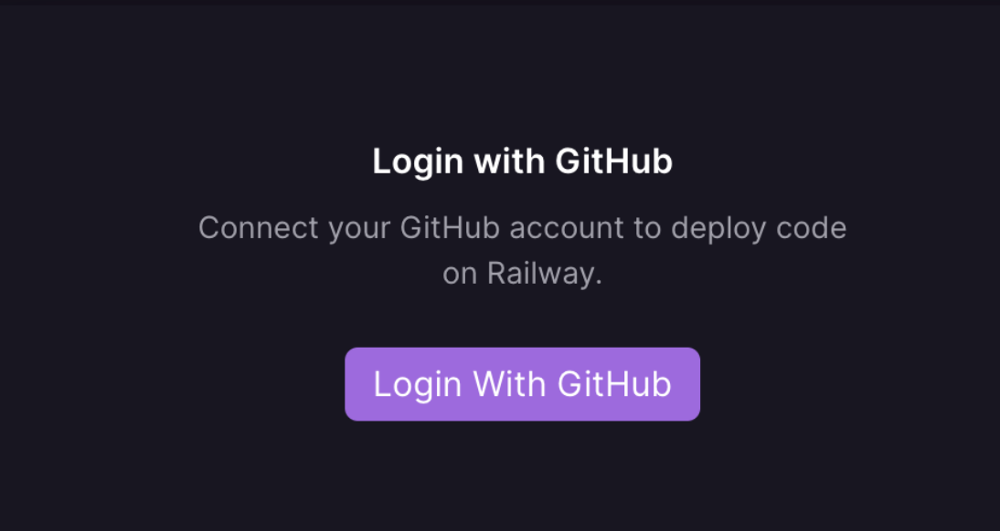

Once this is all done, go to the [dashboard](https://railway.app/dashboard) and create a new
app:

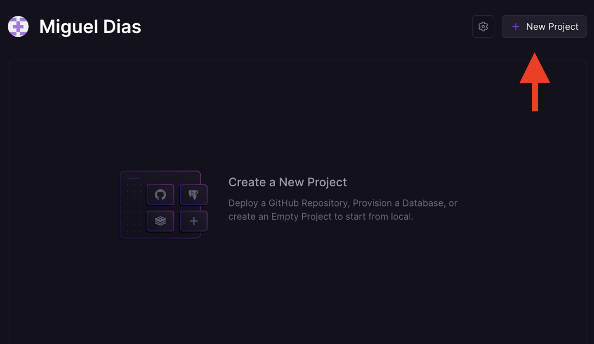

Then on the next screen, we'll reselect the "deploy from GitHub" option. Grant access to your repositories and select the appropriate one. Afterwards click on "Deploy now". 

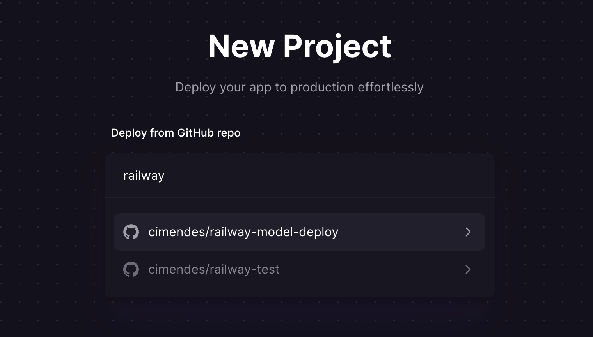
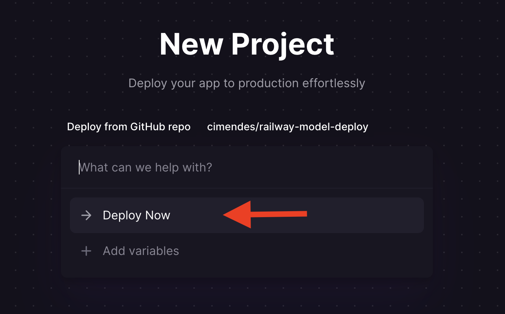

Once this is done, you'll be taken to the main dashboard where you'll see your application building. Wait until it's completed, signaled by a green box saying "Success". **In this tab we can see a button that will allow us to check the logs of our app.** This will be very important to check whether our app is responding successfully to the requests sent or not.

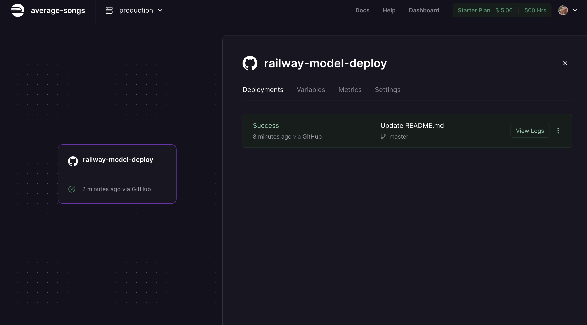

Go to "Settings" and scroll down to "Generate Domain". Click on the "Generate domain" button. **This will generate a url for your app, and we can use it to make requests to your app.**

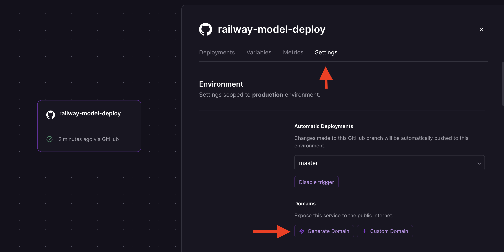
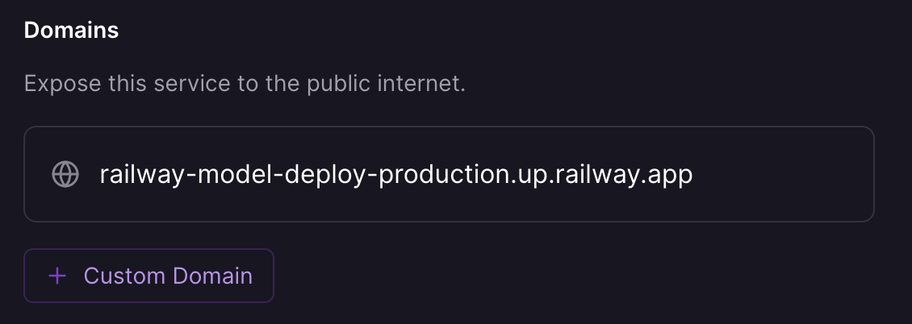

One last thing before we can move on to the database creation, we need to redefine what port our requests will be coming from. As seen above, we're using `port 5000`. We can define this by going to the "Variables" tab, and add a new `PORT` variable with this value.

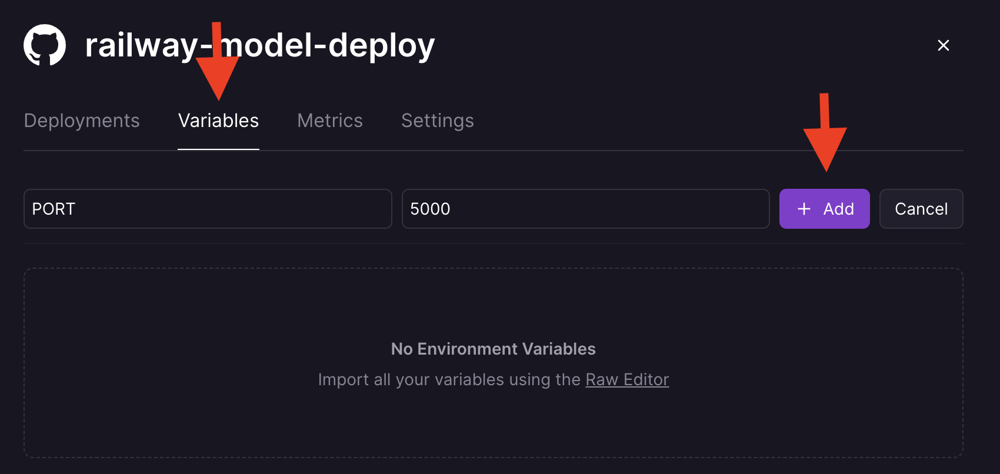

### 6.3 Database 

One last bit is missing here: **the database**. We are going to use a big boy database
called postgreSQL. You should try to be conservative with how you connect to the app and don't go crazy with it. If the database gets full your app will stop working!

You can check railway's postgreSQL guide [here](https://docs.railway.com/guides/postgresql).

To add a Database to our app, go to the dashboard, right click and select a new service to add:

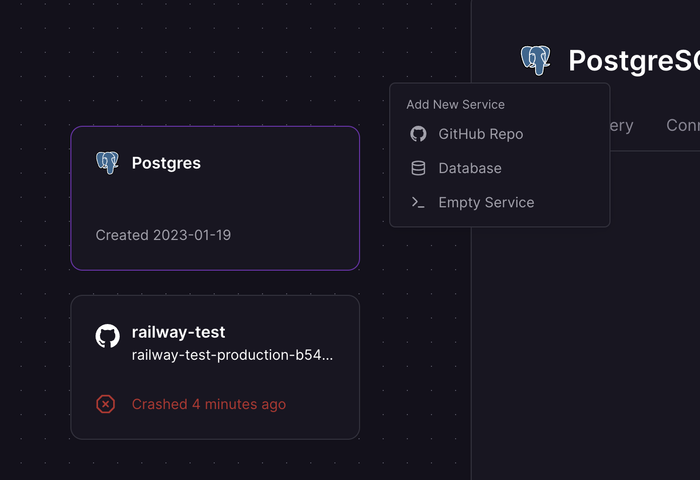

The database should automatically connect to your app. Go to "Variables" and check that you have the `DATABASE_URL` variable defined:
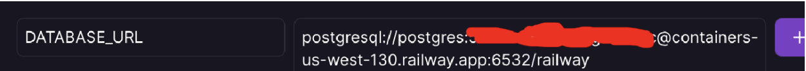

Wait for the app to redeploy after adding the database and test that the app is connected to the database like this:

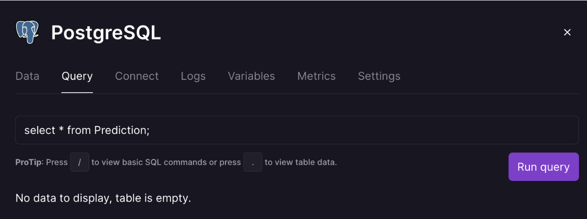

There is no data in the table, but it exists because the query ran successfully.

### 6.4 Remove deployment

To stop billing and resource usage, you'll need to stop the application from running. To do so, find your app and database in the dashboard and select the 3 dots in the most recent deployment. Select "Remove". 

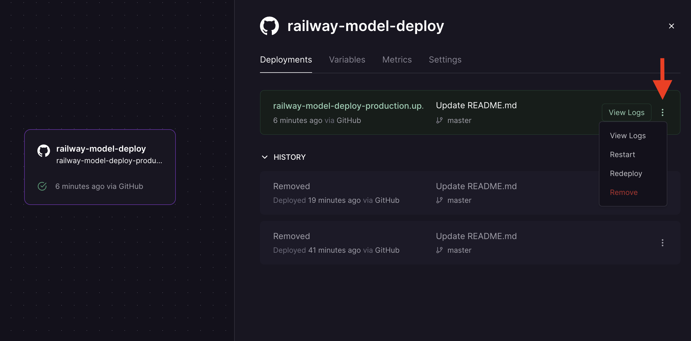
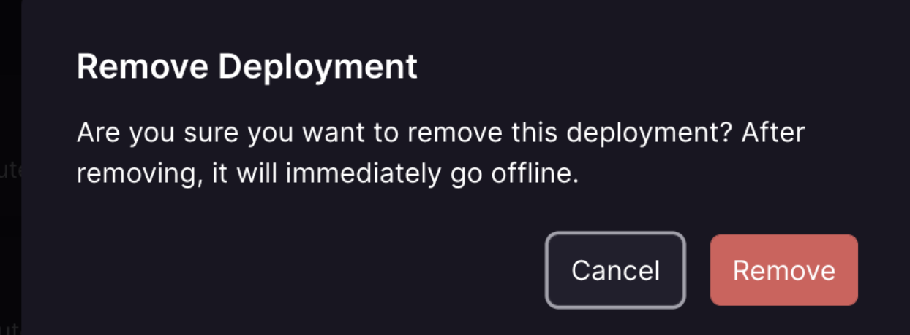

It is very important to do this everytime you stop working with the app, otherwise you can run out of credit!

### 6.5 Final remarks

We have now successfully deployed our app **IN THE CLOUD, WAAAT?!?!**
It is important to remember that any changes you make to your app locally need to be transfered to the repository (add, commit) to be deployed. So if you change your pipeline and retrain a different model you'll need to commit the changes before
rebuilding in railway.

And boom! We're done and deployed! You can actually see this working by executing some of the curl commands that we saw before but using the URL we've obtained before from railway, rather than `http://localhost` like earlier. For my app it looks like the following:

 ```bash
curl -X POST https://<given_url>/predict -d '{"id": 0, "observation": {"Age": 22.0, "Cabin": NaN, "Embarked": "S", "Fare": 7.25, "Parch": 0, "Pclass": 3, "Sex": "male", "SibSp": 1}}' -H "Content-Type:application/json"
```
Output:
```bash
{
  "proba": 0.09194812456330213
}
 ```

 And we can receive updates like the following:

 ```bash
curl -X POST https://<given_url>/update -d '{"id": 0, "true_class": 1}' -H "Content-Type:application/json"
```

Output:
```bash
{
  "id": 1,
  "observation": "{\"id\": 0, \"observation\": {\"Age\": 22.0, \"Cabin\": NaN, \"Embarked\": \"S\", \"Fare\": 7.25, \"Parch\": 0, \"Pclass\": 3, \"Sex\": \"male\", \"SibSp\": 1}}",
  "observation_id": 0,
  "proba": 0.09194812
  "true_class": 1
}
```

How does all of this work you ask? Well, it has to do with the fact that there exists a `Dockerfile` in this repo. This file defines the environment in which the app runs. Just be sure that this file is in your repo and that all is committed before you build your app in railway, and everything should work. If you do a deploy and it doesn't work, take a look at the files and see if you might have done something such as change a filename or something else that would break the boilerplate assumptions that we've made here.

### 6.6 Import problems

If you are using something like a custom transformer and get an import error having to do with your custom code
when unpickling, you'll need to do the following.

#### 6.6.1 Put your custom code in a package

Let's say that you have a custom transformer, called `MyCustomTransformer`, that is part of your
pickled pipeline. In that case, you'll want to create a [Python package](https://www.learnpython.org/en/Modules_and_Packages)
from which you import the custom transformer in both your training and deployment code.

In our example, let's create the following package called `custom_transformers` by just creating a directory
with the same name and putting two files inside of it so that it looks like this:

```bash
└── custom_transformers
    ├── __init__.py
    └── transformer.py
```

And inside of `transformer.py` you can put the code for `MyCustomTransformer`. Then, in your training code, you can import them with:

```py
from custom_transformers.transformer import MyCustomTransformer
```

When you unpickle your model, Python should be able to find the custom transformer too.

The dependencies of your custom transformer should be added to both requirements files.

### 6.7 Last few notes

There were a few additional changes to `app.py` and the rest of the repo that we haven't covered yet, so
let's get that out of the way. You probably won't need to know much about them but if you are having
troubleshooting issues, knowing the following may come in handy.

#### 6.7.1 The db connector

When our app is running on railway, we want to connect to a postgres database, rather than to an sqlite one.
Thus, we had to change the database-related code to something that takes care of this:

```py
import os
from playhouse.db_url import connect

DB = connect(os.environ.get('DATABASE_URL') or 'sqlite:///predictions.db')
```

The connect function checks if there is a DATABASE_URL environment variable. If it exists, it is used to connect to a remote postgres db. Otherwise, the function connects to a local sqlite db stored in the predictions.db file.
